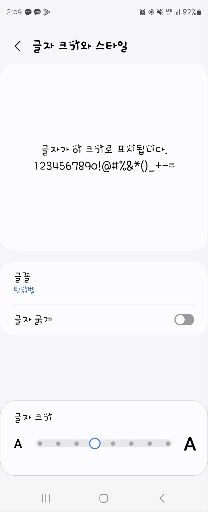
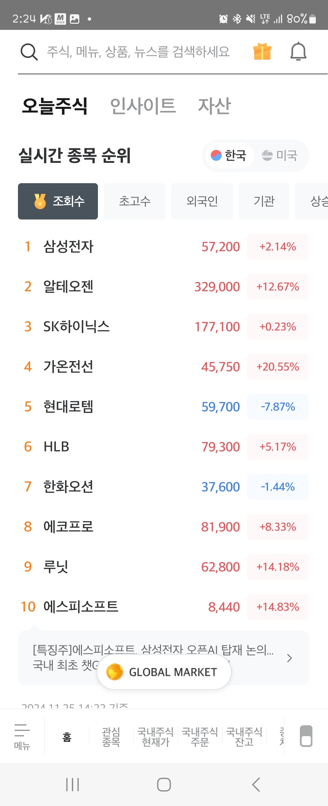
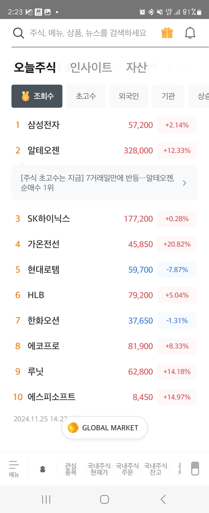
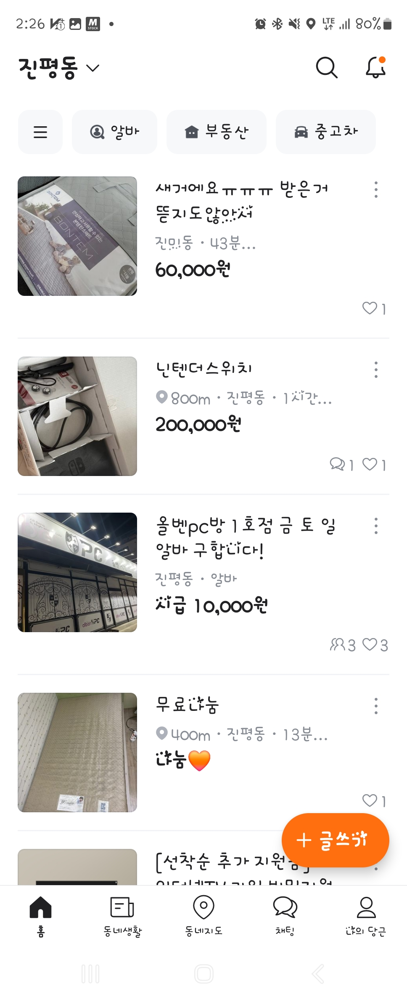
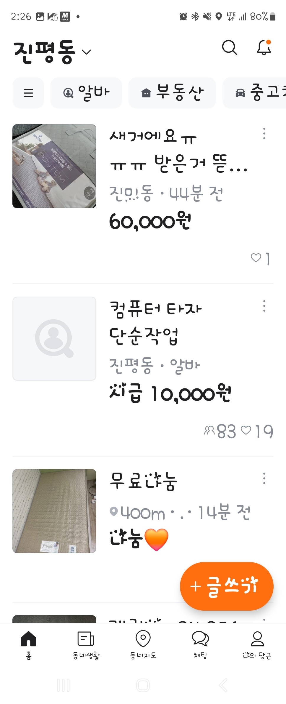

- toc
{:toc .large-only}

## PX이란
**픽셀이란 Display를 구성하는 가장 작은 단위**로 하나 하나의 픽셀이 ARGB 등의 정보를 통해 색을 표현하는 것이다.

우리가 쓰는 TV, 컴퓨터 모니터 등 화면을 출력하는 기기에는 이러한 픽셀들이 여러개가 들어가 있고,    
이러한 픽셀이 많을수록 디테일한 부분도 자세하게 색 표현이 가능해지면서 해상도가 좋아진다고 한다.

그리고 가로 한 줄의 픽셀 수와 세로 한 줄의 픽셀 수를 바탕으로 화면의 해상도를 표현하곤 하는데,    
대표적인 예가 1920 x 1080 같은 예다.

1920 x 1080는 FHD (Full HD) 해상도이기도 하다.
{:.note title="Note"}

## DP란

**DP란 Density Independent Pixel로 픽셀과 독립된 크기로 표현하는 단위**이다.

**Android는** 일반적인 컴퓨터 모니터와는 다르게 **기기마다 매우 다양한 해상도**를 가지기 때문에,    
픽셀로 크기를 설정하는 것은 의도하지 않은 디자인을 야기할 수 있다.

예를 들면,    
해상도가 4 x 4인 단말기에서 width와 height가 2px인 것의 크기는 화면의 사분면 중 한 곳을 차지하고 있겠지만    
2 x 2인 단말기에서는 화면의 전체를 차지하게 된다

그러므로 해상도와 상관없이 일정한 크기를 가지도록 하고자 나온 것이 DP이다.


기본적으로 Android 공식문서에 따르면 **160dpi를 기준으로 1dp는 대략 1px과 동일**하다고 한다. 

Dot Per Inch의 약자로 1인치에 들어있는 픽셀의 갯수를 의미한다.
{:.note title="DPI란?"}

>[안드로이드 공식 문서 링크 바로가기]("https://developer.android.com/training/multiscreen/screendensities?hl=ko")

+ ### DP to PX
  앞서 160DPI를 기준으로 1px과 1dp가 동일하다고 하였는데, 이를 바탕으로 DP에서 PX을 계산할 수도 있다.

  결론적으로 수식은 아래와 같다    
  $$
  \begin{aligned}
   px = dp * (dpi / 160)
  \end{aligned}
  $$

    다만 이미 이 또한
    ```kotlin
    TypedValue.applyDimension()
    ```
    위 함수로 변환을 지원하고 있으므로 외울 필요는 없다.

## SP란

SP는 Scale Independent Pixel로 기본적으로 DP와 같지만 스마트폰의 경우 사용자의 설정에 따라서 글자 크기를 조정할 수 있다.

이에 따라 유동적으로 글자의 크기가 변하는데 이것까지 반영된 것이 sp이다.

{: width="300"}
위에 있는 글자 크기 변경이 어플 내의 글자 폰트 크기에도 반영이 된다
{:.figcaption}

기본적으로 Text들은 sp를 사용해야 하지만, 이러한 글자 크기의 변경을 막고 싶다면 dp로도 설정을 하는 경우가 있는 듯 하다.

테스트를 해보면 앱마다 글자가 바뀌는 것이 있고 아닌 것이 있는 것을 볼 수 있다.

예를 들면

|크기 보통|크기 최대|
|:--:|:--:|
|{: width="300"}|{: width="300"}|
|{: width="300"}|{: width="300"}|
{:.stretch-table}
미래에셋증권 어플과 당근 어플을 비교해보았다.    미래에셋은 변하지 않는 반면 당근은 폰트 설정 시 변하는 것을 볼 수 있다
{:.figcaption}

디자인을 감안해서 꼭 제약이 필요한 경우에는 dp를 사용하고 그 외의 일반적인 경우에는 sp를 쓰는 것이 권장된다.