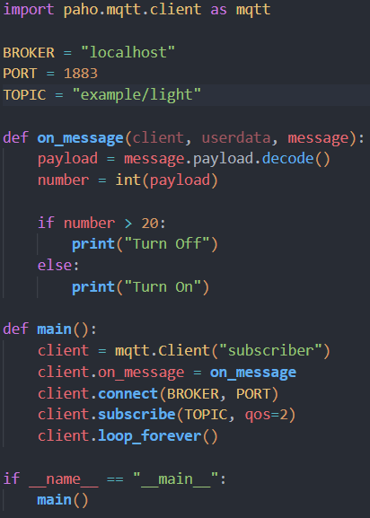

- toc
{:toc .large-only}

## MQTT
+ ### MQTT란?
    M2M, IOT를 위한 프로토콜로, 최소한의 전력량과, 패킷량으로 통신하는 것

+ ### M2M이란?
    Machine to Machine으로 기계 간 통신하는 것을 의미

    + #### IOT와 M2M의 차이
        IOT는 사물, 기기들이 Network에 연결되어 정보가 공유, 수집된다면, M2M은 이러한 Internet 없이 오직 기기끼리만 통신을 하는 것

        Ex:) 인체 감지 센서를 통한 자동 조명 제어 시스템

+ ### MQTT 통신 구조
    기존의 Server와 Client간 통신하던 구조와 달리, **중계자(Broker)**를 거쳐서, 수신자와, 발행자로 나뉘어, Topic으로 들어온 Message를 수신하고, 발행하는 역할로 나뉨

    + #### Server, Client
        flowchart LR
        id1((Server)) --> id2

        id2((Client)) --> id1

    + #### MQTT

        flowchart LR
        id1((Subscriber))

        id2((Broker)) --> id1

        id3((Publisher)) --> id2

+ ### 기초 예제
  + 1. MQTT 설치 폴더에서 CMD 실행
  + 2. MQTT Broker 실행
    
  + 3. MQTT Subscriber 실행
  + 
  + 4. MQTT Publisher가 메세지 발행
    
  

  + 수신 결과
    + Broker 화면
        
        Broker 화면
        {:.figcaption}
    + Subscriber 화면
        
        Subscriber 화면
        {:.figcaption}

+ ### 기기 간 통신 예제
    + #### 상황
      + 밝기 센서와 스위치가 서로 통신을 하는 상황이라고 가정
      + 밝기가 20이하면 전등 ON, 초과일 경우 전등 OFF 로직 구현

    + #### 방법
        1. Broker 실행
        2. 통신 위한 Code 작성
            + Subscriber(Switch)
                
                
            + Publisher(Light)
                
        3. Subscriber(Switch) 실행
            
        4. Publisher(Light) 실행
            

    + 수신 결과
        
        Switch 수신 결과
        {:.figcaption}

+ ### IOT 통신 예제
    + #### 상황
      1. Light가 Light 관련 정보를 송신
      2. Light의 정보를 Broker를 통해 IOT 서버에서 수신
      3. 서버에서 크기에 따라 Switch On, Off Logic 구현
      4. 서버에서 판단 후 Switch에게 On, Off 정보를 송신
      5. Switch에서 정보를 수신 후 Logic 수행 후, 서버에게 다시 Logic 수행 메세지 송신
      6. 서버에서 메세지 송신

    + #### 방법
        1. Broker 실행
        2. 통신 위한 Code 작성
            + Light
                
            + IOT
                
            + Switch
                
        3. Iot실행
            
        4. Switch 실행
            
        5. Light 실행
            

    + 수신 결과
        
        IOT에서 Light 값 수신 및 Switch에서 Logic 수신
        {:.figcaption}

        
        IOT에서 Operation 수신 및 Logic 출력
        {:.figcaption}