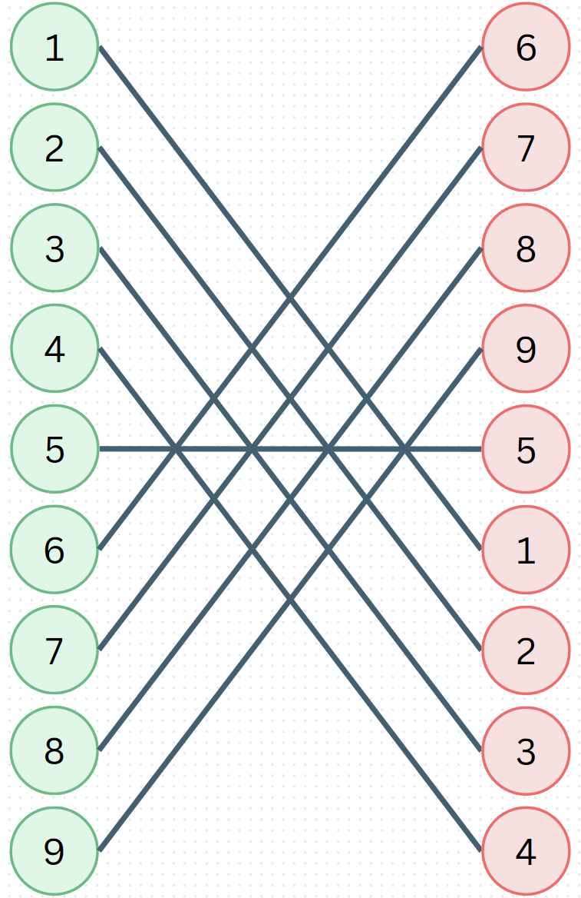

---
# 파일 이름이 html의 경로가 되는데 ₂같은 것이 안먹힘
# 카테고리 등에는 다 적용되는데 이름에는 안먹히니까 참고
layout: post
title: 전구_2550
categories: [study, ps, boj]
tags: [blog]
---
- toc
{:toc .large-only}

## 문제 : [전구](https://www.acmicpc.net/problem/2550)

+ ### 간단 요약
    왼쪽에는 스위치, 오른쪽에는 전구가 있고 각각 번호가 있다.   
    서로 일치하는 번호끼리 선이 연결되어 있을 때,   
    어떻게 해야 선이 교차되지 않고 가장 많이 연결할(킬) 수 있을까?
    {:.lead}

+ ### 데이터

  |   |N|
  |:--:|:--:|
  |의미|스위치(전구) 수|
  |범위|1 ~ 10,000|

+ ### 실패한 접근법
  + #### 그리디
    전에 중량제한 포스팅과 마찬가지로,   
    이번 것 역시 최대로 킬 수 있는 수와 그때의 전구 번호를 구하는 것이었기 때문에   
    Greedy, DP, Binary Search가 나의 예상 범위 안에 들어왔다

    그 때 당시 팀원들과 시간을 제한하면서 풀었기에, 직관적으로 봤을 때 이 스위치와 **전구의 인덱스 차이가 적으면** 당연하게도 가장 많이 연결할 수 있을 줄 알았다

    다만 결론적으로 이 경우는 실패했다
    {:.lead}     
    왜냐하면 아래와 같은 경우가 있기 때문이었다

    {:.lead loading="lazy"}

    차이가 많은 것을 우선적으로 선택할 경우 위 예시에서는 5를 먼저 선택하게 된다  

    다만 이 경우 다른 것들을 선택하면 전부 꼬이므로 최대 길이가 1이라는 잘못된 답을 출력한다
+ ### 접근법
    이분 탐색으로 접근을 하려고 해도, 몇개를 연결할 수 있는지 테스트 하는 방법이 간단하지 않고, 그 때의 전구를 알아야 하니 불가능해보인다   
    결론적으로 이 문제는 **LIS**라는 DP 문제를 알고 있어야지 풀 수 있다

    + #### LIS란
      Longest Increasing Subsequence
      {:.faded}
      LIS는 최장 증가 부분 수열을 말한다

      10, 50, 20, 15, 30, 40 이라는 값이 순서대로 들어왔을 때   
      최장은 10, 20, 30, 40 or 10, 15, 30, 40으로 최장 길이는 4가 된다

    
    이를 알고서 본다면, 스위치와 같은 번호의 전구가 위치한 Index를 배열로 담았을 때,   
    이 값들의 최장 증가 부분 수열의 길이와 그 때의 전구 번호를 출력하는 문제가 된다

    위 반례 예시를 기준으로 보자면 6,7,8,9,5,1,2,3,4 가 될 것이고 이러한 값이 들어왔을 때의 최장 길이와 그 때의 전구 번호를 구하면 된다

    다만 여기서 난 한가지 실수를 했다

    + #### 잘못된 로직
        ```c++
        #include <iostream>
        #include <map>
        #include <algorithm>
        using namespace std;

        int leftLight[10001];
        int rightLight[10001];
        map<int,int> lightIdx;
        int num[10001];
        int dp[10001];


        int main(){
            ios::sync_with_stdio(false);
            cin.tie(0);

            int n;
            cin >> n;

            for(int i = 1; i <= n; i++){
                cin >> leftLight[i];
            }

            for(int i = 1; i <= n; i++){
                int data;
                cin >> data;
                rightLight[i] = data;
                lightIdx[data] = i;
            }


            for(int i = 1; i <= n; i++){
                num[i] = lightIdx[leftLight[i]];
            }

            dp[0] = 0;
            int dpSize = 0;
            int temp[10001];
            int ans[10001];
            for(int i = 1; i <= n; i++){
                int left = 0;
                int right = dpSize;
                while(left <= right){
                    int mid = (left + right)/2;
                    if(num[i] <= dp[mid]){
                        right = mid -1;
                    }else{
                        left = mid + 1;
                    }
                }
                if(left == dpSize + 1){
                    dp[++dpSize] = num[i];
                    for(int j = 1; j <= dpSize; j++){
                    ans[j] = rightLight[dp[j]];
                    }
                    
                }else{
                    dp[left] = num[i];
                }
            }

            sort(ans + 1, ans + dpSize+1);
            
            cout << dpSize << "\n";   
            for(int i = 1; i <= dpSize; i++){
                cout << ans[i] << " ";
            }
        }
        ```
        잘못된 코드이므로 일일이 주석 설명은 생략한다.
        {:.figcaption}

        여기서 보면 되는 부분은 **if(lfet == dpSize + 1)** 쪽의 코드로,   
        해당 전구가 지금까지의 전구보다도 **뒤에 위치할 때 최장 길이의 숫자를 갱신했고**,   
        이 때 나는 **그때의 dp 배열에 저장되어 있는 index를 기반으로 전구 번호를 ans에 넣고서 정렬을 돌린 뒤 출력했다**

        결론적으로 이 코드는 잘못되었는데, 백준에서 제공된 기본 예시와 질문 게시판의 글의 테스트 케이스, 기타 예시를 넣어보아도   
        정답이 나오는 바람에 예외를 찾기 힘들었다   

        이 문제를 해결하는데 도움을 준 [~~지인~~ <U>귀인</U>](https://www.acmicpc.net/user/hsun5163)에게 너무너무 감사하다
        {:.faded}

        이 코드에서 잘못된 점은 **최장 길이가 갱신될 때 dp 배열에 저장된 값이 answer라고 생각했던 점이다**   

        아래 예시를 보자

        {:.lead loading="lazy"}

        이러한 입력이 들어올 경우 정답은 [1,3,4,5,6]이지만   
        2에 대해서 진행할 때 최장배열은 3을 갈아끼워 [1,2,4,5]가 되고,   
        그 다음 6이 들어오면서 [1,2,4,5,6]이 된다   
        이 때 최장 길이가 늘어나게 되면서 [1,2,4,5,6]을 answer로 저장하게 되고 이를 출력한다

        + ##### 문제점
          문제점은 2가 저곳에 위치할 수 있는 것은 맞지만, 2가 저곳에 있으면서 최장 길이가 되려면 기존의 3뿐만 아니라,   
          2가 가로지른 4와 5도 모두 2보다 뒤에 있는 데이터에 의해 갈아끼워져야 했다는 것이다 

          본 코드에서는 2가 3의 위치로 온 뒤에 4와 5가 바뀌지 않은채로 6이 맨 뒤로 추가되면서 더렵혀진 데이터가 answer로 등록되는 문제가 있었다

          그렇다면 어떻게 해야 할까

        + #### 해결책
            저장은 본 코드 그대로 진행하면서, 각 스위치마다 최장길이를 위한 전구의 최적 인덱스를 따로 저장해두었다가 뒤에서부터 탐색하면서 순서대로 전구를 찾아내는 것이다

            똑같은 위치에서 설명을 진행하면   
            5번 인덱스인 2에 대해서 진행할 때 최장배열은 3을 갈아끼워 [1,2,4,5]가 되고,   
            이 때 2는 2번 인덱스에 위치하므로 idxList는 [1,2,3,4,2]가 되는 것이다   
            그리고 마지막 6번 인덱스의 6이 맨 뒤로 가게 되면서 idxList는 [1,2,3,4,2,5]가 된다

            그리고 뒤에서부터 탐색하면서 거꾸로 5번째부터 1번째 전구까지 찾아낸 뒤 오름차순으로 출력하기 위한 정렬을 거쳐 답을 뱉으면 된다.

            앞에서부터 탐색할 경우 앞의 데이터가 이미 뒤의 데이터에 의해서 갈아끼워졌을 확률이 있기 때문에 뒤에서부터 해야 한다
            {:.note title="Note"}


+ ### 코드
  ```c++
  #include <iostream>
  #include <map>
  #include <algorithm>
  #include <vector>
  using namespace std;

  // i번째 위치에 몇번 스위치가 들어왔는지 저장하는 배열
  int leftLight[10001];
  // x번 스위치와 연결된 x번 전구가 몇번째 위치에 있는지 저장하는 Map
  map<int,int> lightIdx;
  // 왼쪽의 i번째 위치에 있는 스위치랑 연결된 전구가 몇번째 위치에 있는지 저장하는 배열
  int num[10001];
  // 최장 배열을 위한 수를 기록하는 dp 배열
  int dp[10001];
  // i번째 스위치에 해당하는 전구가 몇번째로 켜지는 것이 좋은지 최적의 인덱스를 저장하는 배열
  int numIdx[10001];

  int main(){
      ios::sync_with_stdio(false);
      cin.tie(0);
  
      int n;
      cin >> n;
  
      for(int i = 1; i <= n; i++){
          cin >> leftLight[i];
      }
  
      for(int i = 1; i <= n; i++){
          int data;
          cin >> data;
          // data번 전구는 i번째에 위치한다는 것을 저장
          lightIdx[data] = i;
      }
  
  
      for(int i = 1; i <= n; i++){
        // i번째 스위치의 번호에 해당하는 전구의 위치를 구해서 num[i]에 저장
          num[i] = lightIdx[leftLight[i]];
      }
  
      dp[0] = 0;
      // 최장 길이 사이즈
      int dpSize = 0;

      for(int i = 1; i <= n; i++){
        // LIS를 찾는 방법은 O(n²)과 O(nlogn)의 방법이 있는데 이분 탐색을 통한 O(nlogn)의 방법을 채택했다
        // 이분 탐색을 통해 i번에 위치한 스위치의 전구가 몇번째로 켜지는 것이 가장 좋은지 탐색을 진행한다.
        // 위치가 높을 수록(인덱스가 낮을 수록) 뒤의 전구를 더 많이 켤 수 있을 것이기 때문에 자기가 가장 높게 올라갈 수 있는 곳을 찾는다
        // 결론적으로 left에 전구가 위치할 곳을 가리킨다.
          int left = 0;
          int right = dpSize;
          while(left <= right){
            int mid = (left + right)/2;
            if(num[i] <= dp[mid]){
                right = mid -1;
            }else{
                left = mid + 1;
            }
          }

          // 만약 left가 dpSize 즉 지금 이미 저장된 배열의 크기보다 크다면 맨 뒤로 들어간다는 것이고, 최장 길이가 늘어나는 것이므로
          if(left == dpSize + 1){
              // dpSize를 늘리면서 저장하고, 해당 전구의 최적의 인덱스를 저장한다.
              dp[++dpSize] = num[i];
              numIdx[i] = dpSize;
          }else{
              // 최장 길이가 늘어나는 것이 아니면 이미 있던 것을 바꾸면서 최적의 위치로 들어가는 것이다
              // 바꾸고서, 최적의 인덱스를 저장한다
              dp[left] = num[i];
              numIdx[i] = left;
          }
      }
      // 최장 길이를 반환하고
      cout << dpSize << "\n";
      // 거꾸로 찾아야 하므로 searchIndex를 뒤에서부터 진행한다
      int searchIdx = dpSize;
      // 최장 길이의 전구를 저장하기 위한 vector
      vector<int> v;
      // 뒤에서부터 탐색하면서 
      for(int i = n; i >= 1; i--){
          // 이미 다 찾았다면 탈출
          if(searchIdx == 0){break;}
          // 찾고자 하는 위치와 같다면
          if(searchIdx == numIdx[i]){
              // 해당 전구의 번호를 넣는다
              v.push_back(leftLight[i]);
              // 다음에 찾아야 할 번호로 세팅
              searchIdx--;
          }
      }
      // 전구 번호를 오름차순으로 출력하기 위한 sort 과정
      sort(v.begin(), v.end());
      // 정렬된 순서대로 전구 번호 출력
      for(int i =0 ; i < v.size(); i++){
          cout << v[i] << " ";
      }
  }
  ```